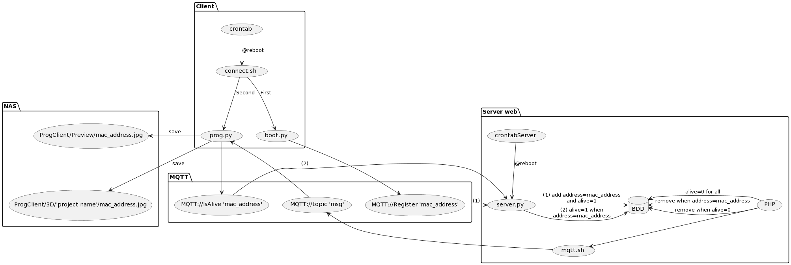
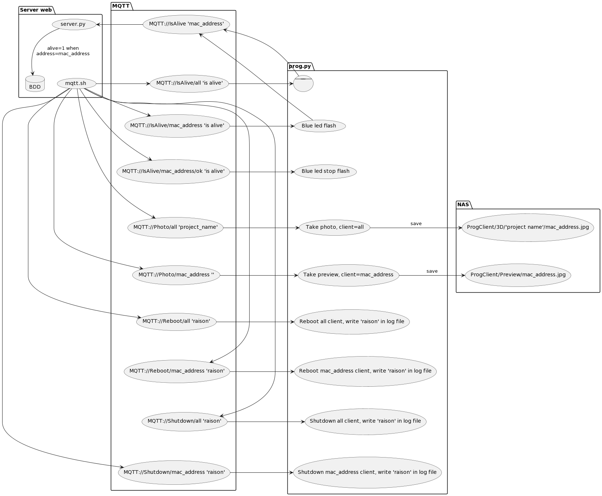
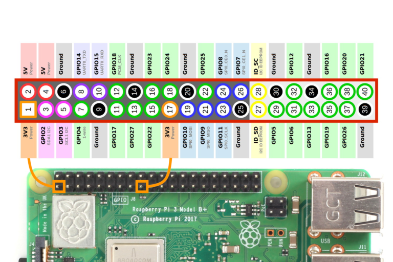

# PROGRAMMES
| Name        | Function                                 |
|------------ | ---------------------------------------- |
|connect.sh   | Script start at the boot of RPI          |
|boot.py      | send mac_address to **Register** topic   |
|Prog.py      | RPI client                               |
|mac.sh       | write mac_address on '/home/pi/mac' file |
|errorGPIO.py | make red led flashes                     |

# SCHEMA
## General

## Mqtt

# MESSAGE MQTT

| Topic                         | Message            | Action                                                                                                 | Exemple 									  					    |
| ----------------------------- | ------------------ | ------------------------------------------------------------------------------------------------------ | --------------------------------------------------------------------|
| Photo/all                     | **Directory_name** | take picture and store them in directory send in message with name  **mac_address.jpg**                |-topic: Photo/all -message: 'Project_directory'                      |
| Photo/**mac_address**         | **what_you_want**  | take picture and store them in **Preview** directory with name **mac_address.jpg**                     |-topic: Photo/34-fr-34-fr-34 -message: ''                            |
| Reboot/all                    | **why**            | Reboot all RPI and write why in log file                                                               |-topic: Reboot/all -message: 'reboot_for_maintenance'                |
| Reboot/**mac_address**        | **why**            | Reboot RPI with the name mac_address name and write why in log file                                    |-topic: Reboot/34-fr-34-fr-34 -message: 'reboot_for_refresh'         |
| Shutdown/all                  | **why**            | Shutdown all RPI and write why in log file                                                             |-topic: Shutdown/all -message: 'shutdown_for_maintenance'            |
| Shutdown/**mac_address**      | **why**            | Shutdown RPI with the name mac_address name and write why in log file                                  |-topic: Shutdown/34-fr-34-fr-34 -message: 'shutdown_for_replacement' |
| IsAlive/all                   | is alive           | All RPI reply by sending their name to **IsAlive** topic                                               |-topic: IsAlive/all -message: 'is alive'                             |
| IsAlive/**mac_address**       | is alive           | RPI with the name mac_address reply by sending their name to **IsAlive** topic and make blue led flash |-topic: IsAlive/34-fr-34-fr-34 -message: 'is alive'                  |
| IsAlive/**mac_address**/ok    | is alive           | Stop blue led flash                                                                                    |-topic: IsAlive/34-fr-34-fr-34/ok -message: 'is alive'               |

All **bold** part may be changed for write the good mac address and the good message

# LUMINOUS MEANING

| Red led       | Green led     | State                                                                                           |
| ------------- | ------------- | ----------------------------------------------------------------------------------------------- |
| Off           | Off           | RPI off or no link with the switch                                                              |
| On            | Off           | Error when mount share directory                                                                |
| Flashes       | Off           | Error whith connection to the MQTT broker                                                       |
| Flashes       | On            | The RPI is connect and disconnect multiple times maybe two RPI have the same name               |
| On            | On            | The python programm have crashed                                                                |
| Off           | On            | The python programm working                                                                     |
| Off           | Flashes       | For locate RPI when you send a specific message                                                 |

# BRANCHEMENTS

| Name     | Pin  |
|--------- | ---- |
| GND      | 14   |
| LED_BLUE | 12   |
| LED_RED  | 16   |

