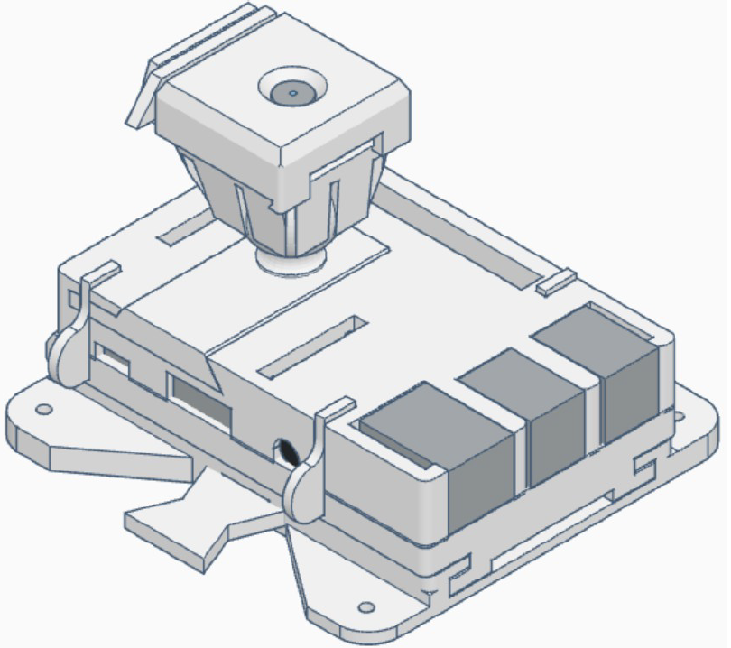

# Notice de montage du boîtier Raspberry pi

# Description
## Présentation
Le boîtier de photogrammétrie Raspberry pi est une coque de protection sur laquelle à été rajoutée
un support d’appareil photo Raspberry sous forme d’une rotule. De nombreuses fonctionnalités ont
été mises en place afin de permettre une utilisation et un entretien simplifié.
L’intégralité des pièces sont imprimables en 3D, les dimensions du modèle lorsque la caméra est
droite sont de 9,4 cm de long pour 9 cm de large pour 6,6 cm de hauteur. Afin de fixer la base du
boîtier à son support, quatre vis ou alternatives doivent être utilisés. Les trous sont adaptés à des vis
M3 (les plus courantes).
Pour n’importe quelle question ou interrogation, n’hésitez pas à contacter à l’adresse mail (celle
adaptée à la photogrammétrie à l’UOF)

## Fonctionnalités
Le boîtier possède plusieurs fonctionnalités adaptés à une utilisation optimale pour la
photogrammétrie.
- Le boîtier du Raspberry pi peut être retiré de son support (qui lui est fixé à la structure par 4 vis)
lorsqu’une goupille est enlevée, et que le technicien fait glisser la partie supérieure du boîtier le
long de la glissière mise en place.
- Deux goupilles sont proposés, une première adaptée pour des changements fréquents (moins
sécuritaire) déplaçable à la main, sans éléments bloquants autres que par la friction entre les pièces
et la gravité (expliqué dans la partie Utilisation), une seconde qui est adaptée pour une sécurité
optimale, utilisant une vis du support comme élément bloquant afin d’éviter que la goupille ne parte
via des secousses ou des personnes mal avisées.
- Le support du boîtier possède une butée permettant d’installer précisément la partie supérieure
pour une problématique de résistance mécanique optimale, Mais il est important de savoir que les
modèles sont adaptés afin que la partie supérieure puisse être installée dans les deux sens, afin
d’éviter des tensions et des longueurs problématique des câbles de ralliement aux Switch ou aux
serveurs.
- Le boîtier est muni d’un support pour l’appareil photo Arduino dans sa version 2.1, qui peut être
tourné et fixé sans forces extérieures appliquées dans trois degrés de liberté.
- des emplacements en dessous de la partie supérieure de la glissière ont été faits afin de noter au
marqueur ou via un post-it les noms des supports et des Raspberry associés, lorsque plusieurs
boîtiers doivent être enlevés, ou que plusieurs structures sont exploitables avec un nombre limité de
Raspberry.
- Le boîtier possède une ouverture large et adaptée à tout type de doigts situé à l’arrière du boîtier
pour permettre l’accessibilité à la carte microSD du Raspberry sans avoir à démonter des pièces.
- Le boîtier est entièrement montable et démontable sans outils.
- L’intégralité des ports du Raspberry pi sont disponibles si une utilisation alternative du boîtier
devait être mise en place.
- L’intégralité des pièces sont fixés mécaniquement entre elles via des goupilles utilisant la
déformation élastique de goupilles afin de tenir. Les matériaux utilisés pour la confection de ces
goupilles doivent donc être choisis pertinemment pour un bon compromis entre sécurité et
utilisabilité.
- Les pièces (en particulier les goupilles) ont été étudiés pour casser sans invalider les pièces
auxquelles elles sont rattachées. Si le boîtier venait à tomber, les bouts des pièces cassées pourront
être enlevés, et la pièce ré-imprimée remplacera l’ancienne sans problèmes (sauf déformation
plastique sans rupture des pièces)

## Notions d’utilisation
- Le support des pièces doit être mis en place de préférence dans une position ou la butée du support
est orientée vers le bas. Même chose pour la goupille sans blocage (une seule position de la goupille
avec blocage par vis est admissible sur le système) qui doit être positionnée de manière à voir sa
tête orientée vers le haut, ou dans une position encourageant la gravité à bloquer la tête contre le
support.
- La position du support de l’appareil photo permet une liberté intéressante des angles que peut
prendre la caméra, néanmoins la solution technologique utilisée afin de la garder en place possède
des limites parfois floues. Premièrement, la position du support ne doit pas mettre en tension les
câbles du système sous peine d’un dysfonctionnement ou de l’endommagement du câble rendant le
système inutilisable. De plus, La rotule et son support peuvent facilement se disloquer lorsque
l’angle pris du support de la caméra est trop grand. Afin d’éviter ce problème, vérifiez lorsque
l’angle est fort que la tête de la boule est bien au fond de la cavité du support via les rainures. De
toute manière, évitez les angles supérieurs à 45 degrés sur le système.
- La glissière support est une pièce qui s’est révélée nécessaire lors de la confection du système
dans un soucis de facilité d’impression. Elle peut également être enlevée lorsque l’utilisation du
boîtier ne demande pas d’appareil photo, ou peut être modifié afin de permettre une utilisation
alternative.